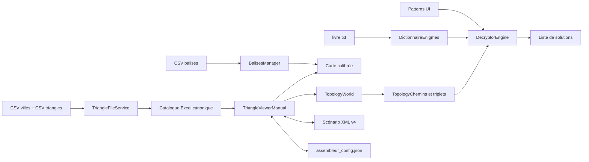
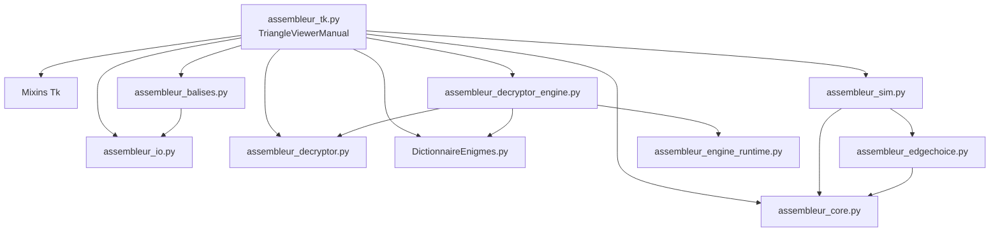
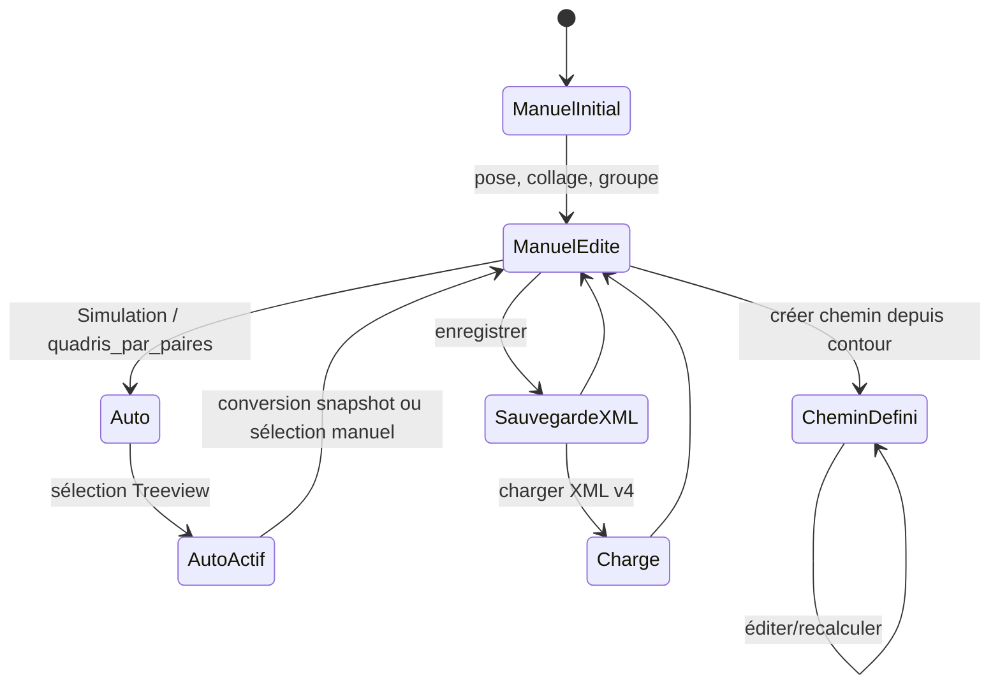
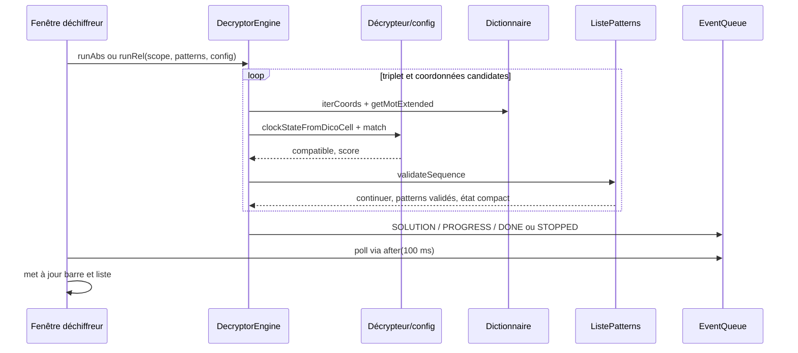
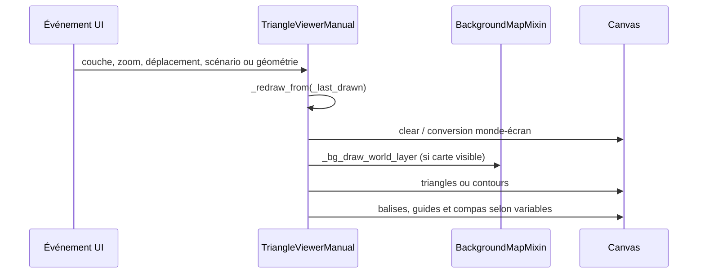

# Analyse fonctionnelle et architecture — Assembleur de Triangles

## 1. Objet du document

Ce document décrit l'application telle qu'elle est au 14 juillet 2026, à partir du code, des données et des tests du dépôt. Il est un point d'entrée pour diagnostiquer un comportement ou préparer une évolution sans présumer d'une réécriture.

Les repères employés sont les suivants : **Établi par le code** désigne un comportement suivi dans les appels ; **Interprétation probable** une finalité suggérée par les données ou libellés ; **À confirmer** ce qui dépend d'un usage humain ou d'une spécification non exécutée ; **Non déterminé** ce que le dépôt ne permet pas d'établir.

## 2. Résumé exécutif

**Établi par le code.** L'application est un poste de travail Tkinter pour charger un catalogue de triangles géographiques, les placer et les assembler manuellement ou automatiquement, maintenir leur topologie, en dériver un chemin de contour sous forme de triplets, puis chercher des séquences de mots d'un dictionnaire d'énigmes qui satisfont des mesures géométriques.

Le point d'entrée est `src/assembleur_tk.py`; `TriangleViewerManual` concentre la majorité de l'interface, de l'état d'interaction et d'une partie des adaptateurs métier. Le noyau non-Tk principal est `src/assembleur_core.py::TopologyWorld`. Les contrats les plus nets sont : topologie et chemins dans le Core, format Excel/scénario/configuration dans `assembleur_io`, dictionnaire/patterns dans `DictionnaireEnigmes`, matching dans `assembleur_decryptor` et recherche dans `assembleur_decryptor_engine`.

**Dette dominante.** La fenêtre principale fait 10 765 lignes et manipule directement de nombreux états GUI, géométriques et de persistance. Une sauvegarde XML est donc une coopération étroite entre `TriangleViewerManual` et `assembleur_io`, pas un modèle autonome. Le décryptage est lancé sur un thread mais sa préparation lit également des objets Tk : c'est une zone de sûreté de thread à traiter avec précaution.

## Comment utiliser ce document

Ce document est une carte de navigation du code actuel, pas une spécification qui autorise à modifier son comportement. Les constats ci-dessous sont **établis par le code** sauf indication contraire ; en cas de divergence, le code et les tests exécutables restent les preuves à réexaminer.

| Besoin | Sections à consulter en priorité | Modules probablement concernés |
|---|---|---|
| Comprendre le fonctionnement général | Résumé exécutif, 6, 7, 9, 12 | `assembleur_tk`, `assembleur_core`, `assembleur_io` |
| Corriger un bug d'interface | 8, Cartographie interne, Sources de vérité, 25 | `assembleur_tk` et les mixins Tk |
| Corriger un bug topologique | 12, 16, Fonctions critiques, 25 | `assembleur_core`, `assembleur_edgechoice`, `assembleur_tk` |
| Corriger un bug de scénario | 13, 19, Sources de vérité, Fonctions critiques | `assembleur_tk`, `assembleur_core`, `assembleur_io` |
| Corriger un bug de carte ou calibration | 15, 17, Cartographie interne, 25 | `assembleur_tk_mixin_bg`, `assembleur_balises`, `assembleur_tk` |
| Corriger un bug de chemin | 16, Fonctions critiques, 22 | `assembleur_core`, `assembleur_tk` |
| Corriger un bug de décryptage | 18, 22, Fonctions critiques, 24 | `assembleur_decryptor`, `assembleur_decryptor_engine`, `assembleur_engine_runtime`, `DictionnaireEnigmes` |
| Ajouter une fonctionnalité | 7, 20, Sources de vérité, 25 | domaine fonctionnel concerné, puis `assembleur_tk` comme orchestrateur |
| Préparer un refactoring | 9, Cartographie interne, Sources de vérité, 24 | `assembleur_tk` d'abord, puis le module métier visé |
| Comprendre un test rouge | 18, 22, Fonctions critiques | le fichier de test cité, puis le module métier correspondant |

Procédure courte recommandée pour une future session :

1. Identifier le domaine fonctionnel et le résultat observable en défaut.
2. Consulter la carte d'intervention (section 25) puis la cartographie de `assembleur_tk.py` si l'entrée est UI.
3. Identifier la source de vérité et ses représentations dérivées dans la section dédiée.
4. Suivre les appelants, les appelés et les effets de bord de la fonction critique concernée.
5. Lire et exécuter les tests ciblés avant toute modification ; noter explicitement les tests absents.
6. Ne modifier qu'après avoir compris les synchronisations UI/Core, scénario actif et persistance impliquées.

## 3. Finalité du logiciel

**Établi par le code.** Le logiciel permet de :

- importer/générer des triangles dont les sommets s'appellent Ouverture (O), Base (B) et Lumière (L) ;
- représenter leurs positions dans un repère « monde », les relier par des attachements topologiques et afficher leur contour ;
- superposer une carte calibrée et des balises GPS projetées en Lambert-93 ;
- choisir un contour, filtrer ses nœuds, créer des triplets `A-O-B`, calculer azimuts, angle et distances ;
- rechercher, dans `data/livre.txt`, les mots dont les coordonnées sont compatibles avec ces triplets et des patterns.

**Interprétation probable.** Les noms des données, des cartes et de `livre.txt` indiquent un outil d'exploration des énigmes de la Chouette d'Or. Le code ne démontre pas la validité historique ou énigmatique des hypothèses ; il fournit des transformations géométriques et combinatoires.

## 4. Périmètre analysé

Analyse statique de tous les modules Python de `src/`, de la suite `tests/`, de `config/`, `data/`, `scenario/`, `images/`, `specs/` et de `.vscode/launch.json`. Les fichiers `.docx` de `specs/` sont inventoriés comme documents de travail ; ils ne sont pas la source de vérité des comportements décrits. Les quatre fichiers Markdown sous `specs/UML/` confirment l'intention du pilotage du moteur et des candidats, mais les flux ci-dessous sont vérifiés dans le code.

Le dépôt ne contient ni manifeste de dépendances Python (`pyproject.toml`, `requirements.txt`) ni empaquetage. Les imports rendent nécessaires, selon les fonctions utilisées : `numpy`, `pandas`, `openpyxl`, `shapely`, `Pillow`, `tksheet`, ainsi que `pyproj` pour Excel géographique, balises et calibration ; `cairosvg` et `reportlab` sont chargés de façon optionnelle pour certaines cartes/PDF. `matplotlib` n'est requis que par `assembleur_debug`.

## 5. Glossaire métier

| Concept | Définition observée et représentation |
|---|---|
| Triangle | Entrée de catalogue Excel, normalisée en ligne `id, B, L, len_OB, len_OL, len_BL, orient`; en affichage, dictionnaire avec points monde `O/B/L`, labels et identifiants topologiques. Voir `src/assembleur_io.py::TriangleFileService._buildCanonDf`, `src/assembleur_tk.py::TriangleViewerManual._triangle_from_index`. |
| Triangle ordonné | Triangle laissé dans la `Listbox` dans l'ordre du catalogue ; l'ordre alimente la simulation `first_n` ou `reverse`. Ce n'est pas une classe distincte. |
| Sommet/nœud | Un sommet physique est `TopologyVertex`; le Core le canonise au besoin en nœud conceptuel par union-find. Les types O/B/L sont `TopologyNodeType`. |
| Attachement | Relation `TopologyAttachment` entre références de sommets/arêtes : vertex-vertex, vertex-edge ou edge-edge. Elle sert à reconstruire groupes et contour. |
| Groupe | Composante topologique `TopologyGroup`; l'UI possède aussi `self.groups` (dictionnaires de nœuds de triangles), donc deux représentations coordonnées mais distinctes. |
| Balise | `Balise(nom, latDms, lonDms, lambertXKm, lambertYKm)`, lue d'un CSV puis convertie en monde à travers la calibration de carte. |
| Compas/horloge | Overlay Tk de deux aiguilles, alimenté par `DecryptorBase.clockStateFromDicoCell`; il peut être ancré à un nœud et produire des guides/mesures d'azimut. |
| Chemin | Unique `TopologyChemins` par `TopologyWorld`: snapshot de contour, masque booléen, ordre de nœuds et triplets dérivés. |
| Scénario | `ScenarioAssemblage`: nom, source manuelle/auto, `TopologyWorld`, dessin, groupes, vue, carte, référence de compas et guides. |
| Dictionnaire | `DictionnaireEnigmes`: lignes titrées et mots normalisés de `livre.txt`, avec étiquettes entre crochets et coordonnées étendues. |
| Pattern | `Pattern` puis `ListePatterns`: syntaxe de mots/catégories/jokers et état compact 2 bits par pattern (`PatternStateSet`). |
| Décryptage | Recherche ABS ou REL de coordonnées de dictionnaire compatibles avec les triplets et les patterns. |

## 6. Vue fonctionnelle générale



Les notions « ouverture » et « fermeture » de triangle sont présentes dans les noms de sommet O/L et dans les données de l'énigme ; **non déterminé** : le dépôt ne définit pas une opération métier générale nommée ouverture/fermeture de triangle distincte de l'assemblage/dégrouper.

## 7. Principaux workflows utilisateur

| Action → résultat visible | Widget/callback | Chaîne effective |
|---|---|---|
| Démarrer | VS Code: `.vscode/launch.json`, module `src.assembleur_tk`; ou exécution directe | `TriangleViewerManual.__init__` crée états, config, UI, puis recharge Excel/carte/balises et le dictionnaire. |
| Ouvrir/générer un catalogue | Menu **Triangle** → `open_excel` / `createTriangleExcelDialog` | `TriangleFileService.loadExcel` ou `createExcelFromCsv`; mise à jour de `df`, `listbox`, config, canvas. La génération projette les villes WGS84 vers EPSG:2154 et écrit temporairement puis remplace le `.xlsx`. |
| Poser/ordonner des triangles | `Listbox`, glisser-déposer/canvas, `_on_triangle_list_select`, handlers canvas | Création d'entrées graphiques, groupes UI et éléments/attachements Core par `EdgeChoiceEpts`; `_redraw_from` redessine. L'ordre restant de la listbox pilote aussi l'automatisation. |
| Simuler un assemblage | Menu **Simulation → Assembler…** → `_simulation_assemble_dialog` | `MoteurSimulationAssemblage` instancie l'algorithme `quadris_par_paires`, produit des `ScenarioAssemblage` automatiques et rafraîchit le Treeview. |
| Afficher carte/couches | Menu **Carte**, panneau Layers | `TriangleViewerBackgroundMapMixin` charge PNG/JPG/SVG, calibration affine, opacité/visibilités ; `_redraw_from` compose carte, triangles, balises, guides et compas. |
| Charger des balises | bouton `...` de Layers → `_onSelectBalisesCsv` | `BalisesManager.loadFromCsv`; `_syncBalisesToWorld` transforme Lambert km → monde et les injecte dans chaque `TopologyWorld` avant chemin/décryptage. |
| Créer/modifier un chemin | clic droit sur contour → `_ctx_CreerChemin`; panneau Chemins | `TopologyChemins.creerDepuisGroupe` calcule le contour, mémorise un masque, construit triplets et géométrie; édition/recalcul/suppression via les méthodes `TopologyChemins`. Treeview mis à jour par `refreshCheminTreeView`. |
| Décrypter | bouton du panneau Chemins → `onDecryptageEngine`, puis Start | UI collecte algorithme, scope, mode, tolérance et patterns; construit `DecryptorEngine`; thread de recherche; `EventQueue` est pollée avec `after(100)` et remplit la listbox de solutions. |
| Sauvegarder/charger | Menu **Scénario** → `_scenario_save_dialog` / `_scenario_load_dialog` | wrappers vers `assembleur_io.saveScenarioXml/loadScenarioXml`; XML v4 et snapshot JSON topologique, puis rafraîchissement du scénario actif. |
| Exporter | Chemins → `onExporterCheminsExcel`; Affichage → PDF; F11/F12 TopoDump | `TopologyChemins.exportXlsx`, `_export_view_pdf`, `TopologyWorld.export_topo_dump_xml`. |

Gestion d'erreur observée : les dialogues de sélection remontent en `messagebox`; les parseurs CSV/XLSX/XML lèvent surtout `ValueError`/`RuntimeError`; plusieurs chargements de démarrage sont best-effort et écrivent une trace console. Le chargement de scénario sans Excel source passe explicitement en mode dégradé.

## 8. Organisation de l'interface

**Établi par le code** (`src/assembleur_tk.py::TriangleViewerManual._build_ui`, `_build_left_pane`, `_build_canvas`).

| Zone | Données et interactions | Rafraîchissement/dépendances |
|---|---|---|
| Menus | Scénario, Triangle, Simulation, Affichage, Carte | Ouvre dialogues et déclenche les mêmes méthodes que les panneaux. |
| Panneau gauche haut | `Listbox` des triangles disponibles, glisser-déposer | `df`, `_placed_ids`, `_last_drawn`; changement de sélection surligne/calcule aides. |
| Layers | cases Carte, Triangle, Compas, Guides, Balises; opacité et mode contours | `BooleanVar`/`IntVar`; compose le canvas par `_redraw_from`. |
| Décryptage rapide | combobox du décrypteur, bases horaires/minutes | modifie l'instance `self.decryptor` et l'overlay, pas la recherche déjà exécutée. |
| Scénarios | Treeview manuel/automatique et barre d'icônes | `_set_active_scenario` échange les références de dessin, groupes, monde et vue; comparaison possible avec scénario de référence. |
| Chemins | Treeview mesures, référence de balise, éditer/recalculer/exporter/décrypter | lit `active_scenario.topoWorld.topologyChemins`. |
| Canvas | carte, triangles, contour, aides de collage, compas, guides, balises | coordonnées écran/monde; événements souris, clavier Escape, Ctrl, roue et configure. |
| Dictionnaire bas | `tksheet`, recherche, filtres, menu contextuel | `DictionnaireEnigmes`; une cellule peut mettre à jour le compas. |
| Fenêtre déchiffreur | paramètres, liste de patterns, barre de progression, solutions | `DecryptorEngine`, `EngineControl`, `EventQueue`; la solution affichée est `mot(r,c) … - score`. |

Synchronisations importantes : le scénario actif porte le `TopologyWorld`; le chemin appartient à ce monde; les balises y sont recopiées avant calcul; la sélection du dictionnaire peut modifier l'état de compas; toute mutation cartographique/triangle passe habituellement par `_redraw_from`. Les guides et référence de compas sont stockés dans le scénario.

## 9. Architecture générale



Il ne s'agit pas d'une architecture à couches stricte : l'UI importe tous les services et contient des ponts de topologie, de sérialisation et de géométrie. En revanche, `TopologyWorld`, `TopologyChemins`, les décrypteurs, l'engin de recherche, le dictionnaire et les fichiers I/O ne dépendent pas de Tk.

Composition/héritage : `TriangleViewerManual` hérite des quatre mixins `Dictionary`, `FrontierGraph`, `BackgroundMap`, `ClockArc`, puis de `tk.Tk`. `TopologyWorld` compose `TopologyChemins`; `ScenarioAssemblage` compose un monde et des états de vue. Les callbacks Tk sont principalement commandes de menu/bouton, bindings `Canvas`, bindings de variables et `after` pour resize/polling.

## 10. Inventaire des modules

| Fichier (taille source) | Imports principaux | Rôle et API principale | Dépendants/statut |
|---|---|---|---|
| `src/assembleur_tk.py` (10 765 l.) | Tkinter, NumPy, PIL, Shapely et tous les modules métier | application, dialogues, canvas, scénarios, ponts UI; `TriangleViewerManual`, `createDecryptor` | **Actif, central**; point d'entrée. |
| `src/assembleur_core.py` (4 700 l.) | NumPy, Shapely, XML | modèle topologique, contour, chemins, XML TopoDump; `TopologyWorld`, `TopologyChemins`, `ScenarioAssemblage` | **Actif, central**, utilisé par UI/simulation/tests. |
| `src/assembleur_sim.py` (1 424 l.) | NumPy, Core, EdgeChoice | assemblage auto, quadrilatères et poses; `MoteurSimulationAssemblage`, `AlgoQuadrisParPaires` | **Actif** via simulation. Contient aussi des classes de décryptage dupliquées non importées par l'UI : **secondaire/probablement historique**. |
| `src/assembleur_io.py` (975 l.) | JSON/XML, NumPy, pandas | Excel, JSON config, XML scénarios; `TriangleFileService`, `saveScenarioXml`, `loadScenarioXml` | **Actif**. |
| `src/DictionnaireEnigmes.py` (888 l.) | itertools, enum, regex/unicode | dictionnaire, scopes, patterns, séquences; `DictionnaireEnigmes`, `Pattern`, `ListePatterns` | **Actif**. |
| `src/assembleur_tk_mixin_bg.py` (931 l.) | Tkinter, NumPy, JSON, PIL optionnel | fonds PNG/JPG/SVG, calibration, déplacement; `TriangleViewerBackgroundMapMixin` | **Actif**. |
| `src/assembleur_tk_mixin_dictionary.py` (847 l.) | Tkinter, `tksheet`, Dictionnaire | grille, recherche/filtres/associations; `TriangleViewerDictionaryMixin` | **Actif**. |
| `src/assembleur_edgechoice.py` (603 l.) | NumPy, Core | choix d'arêtes et création d'attachements; `EdgeChoiceEpts`, `buildEdgeChoiceEptsForAutoChain` | **Actif**, UI et simulation. |
| `src/assembleur_decryptor_engine.py` (429 l.) | Dictionnaire, Décrypteur, Runtime | recherche ABS/REL, candidats, solutions; `DecryptorEngine` | **Actif**. |
| `src/assembleur_tk_mixin_clockarc.py` (384 l.) | NumPy | mesure interactive d'arc du compas; `TriangleViewerClockArcMixin` | **Actif** par héritage et callbacks canvas. |
| `src/assembleur_decryptor.py` (326 l.) | dataclasses, typing | registre des décrypteurs et matching; `ClockDicoDecryptor`, `Frontiere1870Decryptor`, `DecryptorConfig` | **Actif**. |
| `src/assembleur_debug.py` (296 l.) | NumPy, matplotlib | tracés et inspection topo; cinq fonctions `plot*`/`listTopoGroups` | **Secondaire/debug** : aucun appel de production trouvé. |
| `src/assembleur_tk_mixin_frontier.py` (244 l.) | math | aides de graphe de frontière; `TriangleViewerFrontierGraphMixin` | **Actif mais rôle d'aide**, hérité par la fenêtre. |
| `src/assembleur_engine_runtime.py` (206 l.) | threading, queue, time | contrôle pause/stop, file d'événements, checkpoints; `EngineControl`, `EventQueue`, `CheckpointPolicy` | **Actif** pour le décryptage REL. |
| `src/assembleur_balises.py` (145 l.) | csv, dataclasses, `TriangleFileService` | CSV balises + projection Lambert; `Balise`, `BalisesManager` | **Actif**. |

Ressources actives : trois `.xlsx` de catalogues, `triangle_3villes*.csv`, `livre.txt`, `balises.csv`, cartes et calibrations sous `data/maps`, trois exemples XML sous `scenario/`, et icônes PNG sous `images/`. `exports/` est une destination créée à l'exécution, pas une source métier. Les `.docx` de `specs/` et le sous-dossier `specs/old/` sont **documentation/historique**, non chargés à l'exécution.

## Cartographie interne de assembleur_tk.py

**Établi par le code.** Les intervalles ci-dessous ont été relevés dans la version analysée (10 765 lignes). Ils décrivent des zones de responsabilité dominantes, non des frontières étanches : une même méthode peut appeler le rendu, modifier un état de scénario et dialoguer avec le Core.

| Bloc fonctionnel | Méthodes/classes principales | État manipulé | Modules appelés | Lignes approximatives |
|---|---|---|---|---|
| Dialogues initiaux | `DialogSimulationAssembler`, `CreateTriangleExcelDialog` | variables Tk propres aux dialogues | `assembleur_io` par le viewer | 47-360 |
| Initialisation de l'application | `TriangleViewerManual.__init__`, `getTidForTopoElementId` | variables Tk, chemins, config, `scenarios`, `groups`, `_last_drawn`, compas | Core, I/O, balises, décryptage | 361-803 |
| Pont UI vers Core | `_sync_group_elements_pose_to_core`, `_autoSyncAllTopoPoses` | points monde UI, `topoElementId`, poses Core | `TopologyWorld.setElementPose`, NumPy | 686-774 |
| Menus et construction générale | `_build_ui`, `_build_left_pane`, `_build_canvas` | widgets, menus, layers, treeviews | mixins carte/dictionnaire, callbacks viewer | 804-2155 et 4778-4916 |
| Simulation et ordre catalogue | `_simulation_*`, `_simulation_assemble_dialog` | ordre de `listbox`, préférences simulation, scénarios auto, états auto partagés | `MoteurSimulationAssemblage`, `ALGOS`, config | 912-1146 |
| Liste, panneau chemins et dialogue de décryptage | `_refresh_scenario_listbox`, `refreshCheminTreeView`, `onDecryptageEngine` | Treeviews, choix balise, patterns, résultats et runtime du dialogue | `TopologyChemins`, moteur, runtime, dictionnaire | 2156-3621 |
| Scénarios et comparaison | `_set_active_scenario`, `_new_empty_scenario`, duplication/suppression, `_update_current_scenario_differences` | `scenarios`, index actif, `groups`, `_last_drawn`, vues, cartes, comparaison | `ScenarioAssemblage`, Core, I/O indirect | 3649-4777 |
| Canvas et bindings | `_on_canvas_configure`, `_bind_canvas_handlers`, conversions écran/monde | canvas, zoom, offset, caches de pick | callbacks de la classe et mixins | 4778-5115 |
| Sauvegarde, chargement et aide visuelle | `_scenario_save_dialog`, `_load_scenario_into_new_scenario`, wrappers XML, tooltips | scénario actif, `Toplevel`, chemin courant | `assembleur_io` | 5124-5449 |
| Configuration et démarrage différé | `loadAppConfig`, `_persistBackgroundConfig`, `autoLoad*AtStartup` | `appConfig`, fond, fichiers récents, balises | `assembleur_io`, mixin carte, `BalisesManager` | 5452-5565 |
| Import catalogue et balises | `_onSelectBalisesCsv`, `open_excel`, `load_excel`, `_triangle_from_index` | `df`, `excel_path`, `listbox`, balises | `TriangleFileService`, `BalisesManager` | 5566-5722 |
| Dictionnaire | appels `_init_dictionary`, `_build_dico_grid` dans `__init__`; callbacks hérités de `TriangleViewerDictionaryMixin` | `dico`, `dicoSheet`, filtres | `DictionnaireEnigmes`, `tksheet`, mixin dictionnaire | 644-676 pour l'orchestration ; logique détaillée dans `assembleur_tk_mixin_dictionary.py` |
| Rendu des triangles et couches | `_redraw_from`, `_draw_triangle_screen`, `_draw_balises_layer`, `_draw_group_outlines` | canvas, `_last_drawn`, layers, cache de pick | mixin carte, `BalisesManager`, Core via contour | 5723-6337 |
| Sélection, drag depuis liste et aide de collage | `_on_triangle_list_select`, `_on_list_mouse_down`, `_find_nearest_vertex`, `_update_edge_highlights` | `_drag`, `_sel`, `_edge_choice`, aides canvas | `EdgeChoiceEpts` indirect, NumPy | 6365-7246 |
| Pose initiale, groupes UI et rollback | `_place_dragged_triangle`, `_new_group_id`, `_recompute_group_bbox`, `_on_escape_key` | `_last_drawn`, `groups`, `_placed_ids`, poses Core | `TopologyWorld`, Core bridge | 7247-7672 |
| Menus contextuels, chemin et dégrouper | `_on_canvas_right_click`, `_ctx_CreerChemin`, `_ctx_degrouper`, `_applyDegrouperResultToTk` | contexte clic, groupes UI/Core, chemin | `TopologyWorld`, `TopologyChemins` | 7709-8160 |
| Compas, ancrage et guides | `_ctx_*clock*`, `_clock_*`, `_draw_clock_azimuth_traits_layer` | état horloge, ancrage, traits de scénario, filtre dictionnaire | déchiffreur, Core pour nœuds/balises | 8161-9122 |
| Actions contextuelles sur groupes | suppression, rotation, orientation Nord, filtre, flip, `_move_group_world` | géométrie UI, groupes, poses, scénarios auto | Core, synchronisation de pose | 9123-9557 |
| Interactions souris : déplacement, collage et attachements | `_on_canvas_left_down/move/up`, zoom et pan | `_sel`, `_drag`, poses, groupes, attachements, carte | `EdgeChoiceEpts`, `TopologyWorld`, mixin carte | 9558-10283 |
| Export PDF et point d'entrée | `_export_view_pdf_dialog`, `_export_view_pdf`, bloc `__main__` | canvas temporaire, fichier PDF | `reportlab` optionnel | 10491-10765 |
| Messages d'erreur et debug transversal | `messagebox.*`, `_dbgSnap`, raccourcis F9/F10/F11/F12 | `status`, flags debug, exports TopoDump | Tk, `assembleur_debug` et Core selon l'action | dispersé ; points d'entrée 783-803, 6338-6343, 10491-10765 |

Blocs sensibles :

- **Synchronisation UI vers Core (686-765, puis appels dans les interactions).** `_sync_group_elements_pose_to_core` ajuste une pose par élément à partir des trois points visibles et écrit `TopologyWorld.setElementPose`. Il ne synchronise pas les attachements ni la structure de `self.groups`; une modification de géométrie doit donc déterminer si elle touche seulement les poses ou aussi la topologie.
- **Bascule de scénario (4502-4641).** `_set_active_scenario` capture l'ancienne vue/carte, échange par référence `_last_drawn` et `groups`, réconcilie les métadonnées auto, redessine et met à jour plusieurs widgets. Pour le manuel les structures sont partagées avec le viewer ; pour les automatiques elles sont propres au scénario. C'est une zone de désynchronisation particulièrement plausible.
- **Collage au relâché (9923-10248).** Le handler applique d'abord la géométrie visible, synchronise la pose Core, construit éventuellement les attachements, fusionne ensuite les groupes UI, puis redessine. L'ordre est significatif : changer l'un de ces ponts peut laisser l'affichage, les métadonnées de groupe et le Core en désaccord.
- **Décryptage (2842-3621).** `onDecryptageEngine` construit le dialogue, mais la fonction locale `_on_start_decryptage` est appelée dans le worker (3568-3570) tout en lisant des variables Tk et pouvant afficher des `messagebox`. Le moteur est séparé, mais la préparation n'est pas un snapshot pur.

## 11. Points d'entrée et séquence de démarrage

Point d'entrée : `src/assembleur_tk.py` lignes 10762-10765 : instanciation de `TriangleViewerManual`, puis `mainloop()`. La configuration VS Code lance `module: src.assembleur_tk` avec la racine comme CWD.

```mermaid
sequenceDiagram
  participant P as Python
  participant V as TriangleViewerManual
  participant C as assembleur_config.json
  participant U as UI Tkinter
  participant F as TriangleFileService
  participant B as BalisesManager
  participant D as DictionnaireEnigmes
  P->>V: __init__()
  V->>C: loadAppConfig()
  V->>U: _build_ui()
  V->>F: autoLoadTrianglesFileAtStartup()
  V->>V: autoLoadBackgroundAtStartup()
  V->>B: autoLoadBalisesAtStartup()
  V->>D: _init_dictionary(data/livre.txt)
  V->>U: _build_dico_grid(); bind handlers
  P->>V: mainloop()
```

La fenêtre initialise d'abord chemins relatifs (`data`, `maps`, `scenario`, `exports/TopoXML`, `images`), crée ces dossiers si besoin, lit la config puis crée le scénario manuel par défaut. `_build_ui` déclenche les autoloads avant l'initialisation finale du dictionnaire. Une carte est rechargée de façon différée après layout lorsque le canvas n'a pas encore de taille exploitable.

## 12. Modèle de données

### Topologie et géométrie

`TopologyWorld` (`src/assembleur_core.py::TopologyWorld`, ligne 1554) détient éléments, sommets/arêtes, groupes, tables d'union-find, attachements, cache conceptuel/frontières, balises et un `TopologyChemins`. `TopologyElement` conserve géométrie locale, longueurs, labels, pose rotation/translation et miroir. Les coordonnées monde sont dérivées de la pose; `TopologyElementPose2D` garde la réflexion à part de la rotation. `TopologyAttachment` est la source reconstructible de la connectivité; supprimer/dégrouper reconstruit l'état physique plutôt qu'un undo incrémental.

Le cache conceptuel fusionne les occurrences physiques selon les attachements. `TopologyBoundaries.compute` dérive les segments non couverts et un cycle. Les opérations à fort impact sont `apply_attachments`, `rebuild_from_attachments`, `degrouperAtNode`, `flipGroup`, `computeBoundary` et `validate_world` dans `src/assembleur_core.py::TopologyWorld`.

### Scénario, chemin et résultats

`ScenarioAssemblage` (ligne 56) initialise `topoWorld`, dessin/groupes et métadonnées. Le manuel partage par référence `last_drawn`/`groups` avec la fenêtre; les scénarios auto reçoivent des copies. `TopologyChemins` (ligne 990) possède exactement un chemin par monde. Ses invariants sont vérifiés par `_assertDefinedInvariants`: snapshot et masque de même taille, au moins trois nœuds, ordre cohérent avec l'orientation et couverture des triplets.

Un `TopologyCheminTriplet(A,O,B)` calcule `azOA`, `azOB`, `angleDeg`, `distOA_km`, `distOB_km`. `DecryptageCandidateAbs` est immuable, `DecryptageCandidateRel` mutable avec pile de backtracking, et `SolutionDecryptage` est gelée/copiée.

### Dictionnaire et patterns

`DictionnaireEnigmes.chargerFichier` lit une ligne par énigme : premier token = titre, les autres = mots; `mot[tag]` est normalisé en majuscules sans accents et indexé par catégorie. `DicoScope.STRICT`, `MIRRORING`, `EXTENDED` contrôlent les colonnes candidates; la colonne étendue 0 est interdite. Les coordonnées ABS sont `(row 1..N, col != 0)`; le mode REL réutilise un delta de lignes cyclique et une colonne linéarisée sans trou zéro.

## 13. Gestion des scénarios

Création : `_new_empty_scenario` et le scénario manuel de `__init__`. Sélection : le Treeview appelle `_on_scenario_select` puis `_set_active_scenario`, qui échange l'état affiché et applique vue/carte du scénario. Automatisation : `AlgoQuadrisParPaires.run` retourne des scénarios de type `auto`; `_simulation_clear_auto_scenarios` les supprime en conservant les manuels. Duplication/propriétés/suppression sont des callbacks UI de `TriangleViewerManual`.

Cycle de vie :



**À confirmer.** Le code affiche plusieurs scénarios et une comparaison de référence, mais ne définit pas une sémantique scientifique garantissant qu'un scénario auto est équivalent à un scénario manuel de même formes.

## 14. Gestion des triangles

Le catalogue Excel est lu avec recherche de ligne d'entête et normalisé; les colonnes canoniques observées dans les fichiers v9/v10/v11 sont `id, B, L, len_OB, len_OL, len_BL, orient`, avec O implicite dans le jeu de données. `TriangleFileService.createExcelFromCsv` accepte un CSV triangles séparé par `;` (`Ouverture, Base, Lumiere`) et un CSV villes séparé par `,` (`Nom, Latitude, Longitude`), valide les DMS, projette EPSG:4326→2154, calcule longueurs/angles/orientation et écrit l'Excel via un fichier temporaire.

Dans le canvas, une entrée de `_last_drawn` représente la géométrie monde rendue. Coller des triangles entraîne la création ou synchronisation d'éléments `T01`, etc., le choix d'arêtes de `EdgeChoiceEpts` et les attachements Core. Déplacer, pivoter, flipper, dégrouper et suppression sont des commandes contextuelles du canvas : l'UI ajuste la géométrie puis synchronise des poses par élément vers le Core (`_sync_group_elements_pose_to_core`).

## 15. Gestion des balises

`BalisesManager.loadFromCsv` exige exactement `Nom,Latitude,Longitude`, UTF-8 avec BOM toléré, DMS valide et nom unique. Il convertit WGS84 vers Lambert-93 (`EPSG:2154`) et garde les kilomètres. `TriangleViewerManual._syncBalisesToWorld` remplace les balises d'un monde par la version convertie dans le repère monde grâce à l'affine de la carte. Elles sont visibles avec la couche Balises et sélectionnables comme référence de chemin; la référence active est configurée par `cheminsBaliseRefName`.

Conséquence : sans calibration de carte utilisable, `getWorld` ne peut pas produire de coordonnées monde; ceci est une dépendance fonctionnelle pour les mesures qui utilisent la balise de référence.

## 16. Gestion des chemins

Un clic droit trouve le nœud de frontière le plus proche (`_ctx_capture_chemin_context`), puis `_ctx_CreerChemin` utilise l'orientation de frontière et appelle `TopologyChemins.creerDepuisGroupe`. Le Core : calcule le cycle, le pivote sur le départ, active initialement tous les nœuds, ordonne selon cw/ccw, construit les triplets par pas de deux et calcule leur géométrie avec la balise demandée.

`appliquerEdition` remplace orientation/masque et recalcule; `recalculerChemin` régénère après changement du contour tout en rejouant les désactivations par identifiant canonique; `supprimerChemin` rend le conteneur indéfini. `exportXlsx` produit les colonnes sélectionnées par l'UI. La grille des chemins est donc un résultat dérivé, non un format de saisie indépendant.

## 17. Cartographie et couches graphiques

`TriangleViewerBackgroundMapMixin` charge image raster ou SVG, calcule/rend une image de base, la place dans le rectangle monde `x0,y0,w,h`, et conserve opacité/visibilité. La calibration se fait par trois points nommés via les fichiers `*.calib_points.json`; le résultat est un JSON `*.json` contenant les deux transformations affines Lambert km ↔ monde. Les exemples `899*.json` et `Traité_de_Francfort.json` correspondent à ce format.

Les couches sont Carte, Triangle (arêtes internes ou contours), Compas, Guides et Balises. La carte peut être redimensionnée/déplacée; le compas peut être ancré à un nœud, définir une référence d'azimut, tracer des guides persistés par scénario et mesurer un arc. `assembleur_tk_mixin_frontier` fournit des utilitaires de graphe/angles de contour. **Non déterminé** : aucune projection cartographique générale des triangles n'est calculée; leur monde est une géométrie de travail, alignée à la carte seulement par calibration.

## 18. Moteurs et algorithmes de décryptage

### Registre et règles

Le registre `src/assembleur_decryptor.py::DECRYPTORS` contient réellement deux choix :

| Libellé UI / id | Entrée → transformation → sortie |
|---|---|
| `Horloge ↔ Dictionnaire (v1)` / `clock_dico_v1` | ABS : ligne→heure 1..10, colonne positive/négative→minute base 60; REL : delta ligne/colonne. Produit `ClockState` avec azimut heure, azimut minute et angle minimal 0..180°. |
| `Base100 et Frontière 1870` / `base100_frontiere_1870_v1` | fixe les minutes à 100 et calcule `deltaDeg180 = abs(col) * 3.6`; ne dessine pas les aiguilles/labels. |

`DecryptorConfig.match` compare les azimuts O→A/O→B et/ou l'angle 180° du compas avec un triplet, selon les trois cases de l'UI et une tolérance. Au moins une mesure doit être active. La signification énigmatique de « Frontière 1870 » n'est pas dérivable au-delà de cette formule.

### Recherche ABS/REL



`runAbs` construit une frontière de candidats par profondeur et traite les jokers par branche dédiée; `runRel` effectue une DFS avec `DecryptageCandidateRel`, recalage des coordonnées et contrôle coopératif stop/pause. Les résultats sont émis dès qu'un pattern est `YES`; `scoreMax` est en fait une moyenne des scores de la séquence dans `_emitSolutions`. `EngineControl`, `EventQueue`, `RunControlConfig` et `CheckpointPolicy` constituent le contrat de pilotage.

### Assemblage automatique

Le seul algorithme enregistré dans `src/assembleur_sim.py::ALGORITHMES_ASSEMBLAGE` est `quadris_par_paires` (`AlgoQuadrisParPaires`). Il traite les triangles par paires, appelle `createTopoQuadrilateral`, crée deux éléments topologiques et un attachement d'arêtes, puis enchaîne les paires avec `buildEdgeChoiceEptsForAutoChain`. `MoteurSimulationAssemblage` fournit les conversions de poses, contrôles de chevauchement et paramètres d'ancrage. Son résultat est une liste de scénarios auto, non un écrasement obligé du manuel.

## 19. Persistance, configuration, import et export

| Format | Lecture/écriture | Structure et risques |
|---|---|---|
| `config/assembleur_config.json` | `loadAppConfig`, `saveAppConfig`, `get/setAppConfigValue` | dictionnaire de chemins récents, UI, carte, simulation, patterns et décryptage. Chemins absolus observés : non portable. Écriture JSON directe sans verrou/version. |
| `data/*.xlsx` | `TriangleFileService.loadExcel`, `createExcelFromCsv` | entêtes recherchées puis schéma canonique. Génération atomique locale via `.tmp.xlsx`, mais dépend de pandas/openpyxl/pyproj. |
| `data/livre.txt` | `DictionnaireEnigmes.chargerFichier` | texte UTF-8, une énigme par ligne, premier mot=titre, tags `[categorie]`; les espaces empêchent les tags multi-mots. |
| `data/balises.csv` | `BalisesManager.loadFromCsv` | CSV comma, trois colonnes et DMS stricts. |
| `data/maps/*.calib_points.json` | mixin background | trois points WGS84 à cliquer. |
| `data/maps/*.json` | mixin background | calibration affine, date, rectangle, transformations 6 coefficients. |
| `scenario/*.xml` | `saveScenarioXml`, `loadScenarioXml` | XML version strictement `4`: snapshot topologique JSON, chemin, source Excel, carte, horloge, référence/guides, listbox, groupes et triangles. Les chemins de source/carte sont absolus; l'absence de l'Excel est dégradée mais un XML incomplet est refusé. |
| `exports/*.xlsx`, `exports/*.pdf`, `exports/TopoXML/*.xml` | export chemin, vue, `export_topo_dump_xml` | sorties générées; aucun import de ces exports n'est identifié. |

La fonction `saveScenarioXml` documente des champs `view` dans sa description mais l'écriture visible porte principalement snapshot/source/map/clock/listbox/groups/triangles; le chargeur tolère donc l'absence de `view`. C'est **établi par le code**, et mérite vérification lors d'une évolution de format.

## 20. Gestion de l'état et synchronisation de l'interface

L'état central n'est pas unique. Il comprend au minimum `self.df`, `self._last_drawn`, `self.groups`, `self.scenarios`, scénario actif, `ScenarioAssemblage.topoWorld`, `TopologyWorld.topologyChemins`, configuration, objet carte, `BalisesManager`, dictionnaire et de nombreuses variables Tk. Les méthodes `_capture/_apply_view_state`, `_capture/_apply_map_state`, `_set_active_scenario`, `_sync_group_elements_pose_to_core` et `_syncBalisesToWorld` sont les ponts à suivre avant toute modification transversale.

Le déchiffreur communique ses résultats via une `queue.Queue` protégée et le UI la vide dans `after`; pause/stop sont des `threading.Event`. **Risque établi :** `_on_start_decryptage` est appelé dans le worker mais lit des objets de fenêtre/variables Tk et peut appeler `messagebox` sur des validations. Le moteur pur est sans Tk, mais la frontière de thread UI/métier n'est pas totalement étanche.

## Sources de vérité et représentations dérivées

Cette matrice décrit l'état observé, sans proposer de le refondre. **Établi par le code** signifie qu'une structure est effectivement lue ou écrite comme référence dans les appels actuels ; le statut `probable`, `à confirmer` ou `non déterminé` signale une intention ou une priorité qui ne peut pas être déduite avec certitude.

| Domaine | Source de vérité actuelle | Représentations dérivées | Synchronisation | Risque de divergence | Statut |
|---|---|---|---|---|---|
| Catalogue des triangles | `self.df`, chargé par `TriangleViewerManual.load_excel` via `TriangleFileService.loadExcel` | entrées de `listbox`, triangles construits par `_triangle_from_index`, triangles locaux de simulation | chargement Excel puis `_refresh_listbox_from_df` ; lecture de `df` par `MoteurSimulationAssemblage.build_local_triangle` | catalogue absent en chargement XML dégradé ; les triangles posés sont une copie géométrique | établi |
| Ordre des triangles disponibles | ordre textuel de `self.listbox` | liste d'IDs de simulation | `_simulation_get_tri_ids_first_n` / `_simulation_get_tri_ids_by_order` extraient les IDs affichés | l'ordre n'est pas porté par `df` et le parsing dépend du préfixe `id.` | établi |
| Triangles placés | `ScenarioAssemblage.last_drawn` ; pour le scénario manuel, même objet que `self._last_drawn` | canvas, `_placed_ids`, groupes UI, poses Core | pose initiale, chargement XML, `_set_active_scenario`, redessin | index de liste, `id` métier et `topoElementId` sont des identifiants distincts | établi |
| Géométrie affichée | points monde `last_drawn[*]['pts']` dans le scénario actif | coordonnées écran, cache de pick, polygones canvas, bbox UI | `_redraw_from`, conversions `_world_to_screen`/`_screen_to_world` | canvas est une projection jetable ; les poses Core doivent être synchronisées explicitement | établi |
| Topologie | `ScenarioAssemblage.topoWorld` : éléments, DSU, groupes Core, attachements et caches | métadonnées `topoElementId`/`topoGroupId` dans les triangles et groupes UI ; contour et chemin | création d'éléments/attachements, import snapshot, `_sync_group_elements_pose_to_core` pour les poses | UI et Core ne partagent pas une structure de groupe unique | établi |
| Groupes UI | `self.groups` / `ScenarioAssemblage.groups`, dictionnaire de nœuds `tid` et métadonnées | `group_id`/`group_pos` dans `last_drawn`, bbox, Treeview et contour visible | pose, fusion/split/dégrouper, `_set_active_scenario` pour les auto | le groupe UI n'est pas le `TopologyGroup` ; la correspondance passe par `topoGroupId` | établi |
| Attachements | `TopologyWorld.attachments` et `TopologyGroup.attachment_ids` | union-find nœuds/groupes, coverages, cache conceptuel et contour | `apply_attachments`, `rebuild_from_attachments`, import snapshot | aucun équivalent complet dans `self.groups` ; un collage UI mal relayé peut être seulement visuel | établi |
| Contour | cache conceptuel d'un groupe Core, rempli par `TopologyWorld.computeBoundary` | segments UI, cycle orienté, snapshot de chemin | création/recalcul de chemin, dégrouper, dessin des contours | cache dérivé : il doit être invalidé/recalculé après topologie ou pose pertinente | établi |
| Scénario actif | `self.active_scenario_index` dans `self.scenarios` | alias viewer vers `last_drawn`/`groups`, sélection Treeview, vue/carte appliquées | `_set_active_scenario`, import dans un nouveau scénario | le manuel est partagé, les autos ont un traitement de vue/carte partagé au niveau viewer | établi |
| Collection de scénarios | `self.scenarios` | Treeview de scénarios, référence de comparaison, états auto | simulation, nouveau/dupliquer/supprimer/charger | les index servent aussi de clés Tk `scen_<index>` et peuvent être réordonnés/supprimés | établi |
| Chemin | unique `TopologyWorld.topologyChemins` du scénario actif | Treeview Chemins, export XLSX, entrée du moteur | `creerDepuisGroupe`, `appliquerEdition`, `recalculerChemin`, XML | dégrouper peut le supprimer ; une mutation topologique ne recalcule pas automatiquement le chemin observé | établi |
| Triplets | `TopologyChemins.triplets`, dérivés de `pathNodesOrdered` | mesures Treeview et `DecryptorEngine.triplets` (référence prise au constructeur) | création/édition/recalcul du chemin, calcul de géométrie avec balise | un moteur déjà créé conserve la liste qu'il a reçue ; les mesures dépendent de la balise retenue | établi |
| Balises | `BalisesManager` après `loadFromCsv` | points canvas ; `TopologyWorld.balisesWorld` par copie projetée | `_syncBalisesToWorld`, chargement CSV, avant chemin/décryptage | `balisesWorld` peut être périmé si la synchro n'est pas appelée ; projection requiert une calibration | établi |
| Calibration cartographique | données `_bg_calib_data` et `_bg_affine_lambert_to_world` du viewer/mixin | projection des balises et rendu de carte | chargement/calibration de carte par `TriangleViewerBackgroundMapMixin` | carte, rectangle monde et calibration sont des états liés mais distincts | établi |
| Carte affichée | `_bg` (chemin et rectangle monde) et variables de layer/opacité | image Tk `_bg_photo`, état de carte du scénario/config/XML | mixin carte, `_capture/_apply_map_state`, `_persistBackgroundConfig`, chargement XML | l'état auto peut être partagé (`auto_map_state`) tandis que le manuel le garde par scénario | établi |
| Compas | état runtime viewer (`_clock_state`, position/ancrage, `_clock_ref_azimuth_deg`) | overlay canvas ; une partie des références dans `ScenarioAssemblage.clockRef*` | interactions compas, `_set_active_scenario`, XML | le commentaire de `ScenarioAssemblage` désigne le viewer comme seule référence runtime ; le périmètre exact de persistance par scénario est partiellement distribué | à confirmer |
| Guides | `ScenarioAssemblage.clockAzimuthTraits` | traits canvas et menus contextuels | `_ctx_trace_clock_azimuth`, restauration XML, `_draw_clock_azimuth_traits_layer` | valides seulement si leurs IDs de groupe/nœud/edge existent encore | établi |
| Dictionnaire | `self.dico : DictionnaireEnigmes` chargé depuis `data/livre.txt` | grille `tksheet`, filtres, patterns et candidats de moteur | `_init_dictionary`, mixin dictionnaire, dialogue décryptage | le panneau est une vue ; ses filtres UI ne changent pas le texte source observé | établi |
| Paramètres de décryptage | variables du dialogue et `DecryptorConfig` construit au démarrage | `appConfig` des patterns/choix, instance `DecryptorEngine` | persistance locale du dialogue, construction de config puis worker | le worker lit les variables Tk directement ; instance de moteur/config est un snapshot partiel de fait | établi |
| Résultats de décryptage | liste locale `win._solutions` du dialogue ; retour de `runAbs/runRel` | `Listbox` de solutions, événements `EventQueue` | `_poll_event_queue`, `_refresh_solutions_list` | résultats non rattachés au scénario ni sauvegardés dans XML | établi |
| Configuration persistée | `viewer.appConfig`, lue/écrite par `assembleur_io.loadAppConfig/saveAppConfig` | variables Tk, derniers chemins, réglages carte/simulation/décryptage | démarrage, toggles et méthodes `setAppConfigValue` | écriture JSON directe et valeurs de chemins absolus ; les états XML ne sont pas la même source | établi |

Point de lecture important : l'expression « source de vérité » n'est pas globale. Le code maintient volontairement ou historiquement plusieurs représentations à synchroniser. Avant un correctif, il faut donc qualifier l'opération : **géométrie visible seulement**, **pose Core**, **topologie/attachements**, **métadonnées de groupes UI**, **scénario**, ou **persistance**.

## Fonctions critiques : appelants, appelés et effets de bord

Les fiches suivantes sont **établies par le code** dans les versions actuelles des fichiers cités. « Aucun test direct trouvé » ne signifie pas absence de couverture indirecte : il signale seulement qu'aucun test de la suite ne nomme ou n'exerce explicitement cette méthode comme unité autonome.

### `TriangleViewerManual.__init__` — `src/assembleur_tk.py:376`

- Définition et responsabilité : initialise la fenêtre, les variables Tk, les états géométriques/scénarios, la configuration, le scénario manuel, l'UI et le dictionnaire.
- Appelants principaux : bloc `__main__` de `assembleur_tk.py:10762-10765`.
- Fonctions ou services appelés : `loadAppConfig`, `TriangleFileService`, `_build_ui`, `_bind_canvas_handlers`, `_init_dictionary`, `_build_dico_grid`.
- État lu/modifié : crée ou initialise pratiquement tout l'état viewer, notamment `df`, `_last_drawn`, `groups`, `scenarios`, variables de layers et compas ; le manuel partage `last_drawn/groups` par référence.
- Effets de bord et rafraîchissements : crée les répertoires de travail, widgets et autoloads déclenchés par l'UI ; le rendu initial dépend ensuite du layout Tk.
- Exceptions/tests/risques : exceptions de dépendances/fichiers au démarrage ; aucun test GUI direct trouvé. Risque élevé d'ordre d'initialisation et de lecture d'attribut avant sa création.

### `TriangleViewerManual._build_ui` — `src/assembleur_tk.py:804`

- Définition et responsabilité : construit menus, panneaux et zones de l'application, puis lance les chargements de démarrage.
- Appelants principaux : `__init__`.
- Fonctions ou services appelés : `_build_left_pane`, `_build_canvas`, `autoLoadTrianglesFileAtStartup`, `autoLoadBackgroundAtStartup`, `autoLoadBalisesAtStartup` et callbacks de menus.
- État lu/modifié : crée `listbox`, Treeviews, canvas, labels et menus qui sont ensuite supposés par de nombreux callbacks.
- Effets de bord et rafraîchissements : enregistre les commandes Tk et peut charger données/carte pendant la construction.
- Exceptions/tests/risques : erreurs de widgets, fichiers ou dépendances optionnelles ; aucun test direct trouvé. Risque élevé de dépendances implicites entre ordre de création et autoload.

### `TriangleViewerManual._set_active_scenario` — `src/assembleur_tk.py:4502`

- Définition et responsabilité : bascule sur un scénario, conserve/restaure vue et carte, puis rattache les structures visibles au scénario.
- Appelants principaux : sélection/double-clic Treeview, création/duplication/suppression/chargement de scénario, simulation et suppression des autos.
- Fonctions ou services appelés : `_capture/_apply_view_state`, `_capture/_apply_map_state`, `_recompute_group_bbox`, `_update_triangle_listbox_colors`, `_fit_to_view` ou `_redraw_from`, `refreshCheminTreeView`.
- État lu/modifié : `active_scenario_index`, `self._last_drawn`, `self.groups`, `_placed_ids`, vue, carte, métadonnées auto et sélection Treeview.
- Effets de bord et rafraîchissements : rendu complet, overlay, cache de pick, liste de triangles et panneau de chemins sont mis à jour.
- Exceptions/tests/risques : sortie silencieuse si index invalide ; aucun test direct trouvé. Risque de confondre les références partagées manuelles et copies auto, ou de désynchroniser `group_id`/`topoGroupId`.

### `TriangleViewerManual._redraw_from` — `src/assembleur_tk.py:6003`

- Définition et responsabilité : recompose le canvas depuis les triangles monde et les options de couches.
- Appelants principaux : très nombreux callbacks de vue, carte, scénario, mouvement, collage, chemins et resize ; c'est le point de rendu commun.
- Fonctions ou services appelés : `_update_current_scenario_differences`, `canvas.delete`, mixin `_bg_draw_world_layer`, `_draw_triangle_screen`, `_draw_group_outlines`, dessins balises/compas/guides.
- État lu/modifié : lit `_last_drawn`, `groups`, layers, sélection et carte ; invalide les IDs d'aide et le cache de pick.
- Effets de bord et rafraîchissements : détruit et recrée le contenu canvas ; ne reconstruit pas la topologie.
- Exceptions/tests/risques : erreurs Tk/rendu de ressources ; aucun test GUI direct trouvé. Risque de prendre une vue canvas pour une persistance et de perdre les IDs temporaires après `delete('all')`.

### `TriangleViewerManual._sync_group_elements_pose_to_core` — `src/assembleur_tk.py:686`

- Définition et responsabilité : ajuste une pose rigide par élément Core aux trois points monde du groupe UI, en gardant `mirrored` séparé.
- Appelants principaux : pose initiale, rotation/déplacement/flip, collage, dégrouper et synchronisation des scénarios auto.
- Fonctions ou services appelés : NumPy/SVD puis `TopologyWorld.setElementPose`.
- État lu/modifié : lit `self.groups`, `_last_drawn`, `topoElementId`, coordonnées locales Core ; écrit les poses des `TopologyElement`.
- Effets de bord et rafraîchissements : aucun redessin direct ; le caller redessine généralement après la synchronisation.
- Exceptions/tests/risques : ignore des nœuds/éléments incomplets ; aucun test direct trouvé. Risque majeur : il ne met à jour ni attachements ni groupes UI/Core, seulement les poses.

### `TriangleViewerManual._syncBalisesToWorld` — `src/assembleur_tk.py:5560`

- Définition et responsabilité : copie les balises projetées du `BalisesManager` dans un `TopologyWorld`.
- Appelants principaux : recalcul/création de chemin et préparation du décryptage ; le choix CSV rafraîchit aussi les widgets associés.
- Fonctions ou services appelés : `world.clearBalises`, `BalisesManager.listNoms/getWorld`, `world.setBaliseWorldXY`.
- État lu/modifié : lit la collection du manager et la calibration viewer ; écrit `world.balisesWorld`.
- Effets de bord et rafraîchissements : aucun rendu direct ; les appelants recalculent chemin ou redessinent.
- Exceptions/tests/risques : projection peut échouer sans calibration ; `tests/test_balises_manager.py` couvre le manager, pas ce pont Tk. Risque de mesures de chemin obsolètes si l'appel est omis.

### `TriangleViewerManual._ctx_CreerChemin` — `src/assembleur_tk.py:7907`

- Définition et responsabilité : transforme le contexte de clic droit en demande de création du chemin unique du monde actif.
- Appelants principaux : commande du menu contextuel préparée par `_on_canvas_right_click` et `_ctx_capture_chemin_context`.
- Fonctions ou services appelés : `getBoundaryOrientation`, `_syncBalisesToWorld`, `TopologyChemins.creerDepuisGroupe`, `refreshCheminTreeView`.
- État lu/modifié : lit `ctxGroupId`, `ctxStartNodeId`, la référence de balise et le monde actif ; écrit le chemin Core.
- Effets de bord et rafraîchissements : affiche des dialogues d'erreur/remplacement et rafraîchit le Treeview Chemins.
- Exceptions/tests/risques : contexte absent, contour invalide ou balise absente ; couverture indirecte par `test_triplets_smoke.py` et `test_chemins_balise_ref_core.py`. Risque de chemin créé sur un Core dont les poses/balises ne sont pas synchronisées.

### `TriangleViewerManual.onDecryptageEngine` et `_on_start_decryptage` local — `src/assembleur_tk.py:2842, 3470`

- Définition et responsabilité : construit le dialogue, collecte patterns/options, fabrique `DecryptorConfig`, contrôle, file et moteur, puis lance ABS ou REL.
- Appelants principaux : bouton du panneau Chemins/menu ; le bouton Start appelle `_on_startstop_clicked`, qui crée un `threading.Thread` exécutant `_start_worker` puis `_on_start_decryptage`.
- Fonctions ou services appelés : persistance GUI/patterns, `_syncBalisesToWorld`, `ListePatterns`, `DecryptorConfig`, `EngineControl`, `EventQueue`, `DecryptorEngine.runAbs/runRel`.
- État lu/modifié : lit variables Tk, scénario/mondes, dictionnaire ; écrit les attributs runtime de la fenêtre et `win._solutions`.
- Effets de bord et rafraîchissements : thread daemon, polling `after`, événements de progression/statut/solutions et `messagebox` de validation.
- Exceptions/tests/risques : patterns/mesures/tolérances invalides, données de chemin/balises ; les tests couvrent moteur/config/runtime, pas le dialogue. Risque élevé confirmé : préparation effectuée dans le worker avec accès Tk.

### `TopologyWorld.apply_attachments` — `src/assembleur_core.py:3237`

- Définition et responsabilité : applique une liste d'attachements en assurant un ID non collisionnel, puis retourne le groupe canonique final.
- Appelants principaux : collage UI (`_on_canvas_left_up`), création de quadrilatères/simulation et import/reconstruction indirecte.
- Fonctions ou services appelés : `new_attachment_id`, `apply_attachment`, qui valide puis modifie DSU, groupes, couverture et cache.
- État lu/modifié : lit/écrit `attachments`, parents DSU, groupes, éléments et caches conceptuels.
- Effets de bord et rafraîchissements : pas de Tk ; le caller doit synchroniser groupes UI et rendu.
- Exceptions/tests/risques : attachement invalide lève `ValueError`; aucun test direct nommé trouvé. Risque : « transaction simple » sans rollback global si un attachement ultérieur échoue.

### `TopologyWorld.rebuild_from_attachments` — `src/assembleur_core.py:3504`

- Définition et responsabilité : remet DSU, groupes et couvertures à l'état atomique puis rejoue les attachements triés.
- Appelants principaux : suppression d'éléments et `degrouperAtNode`.
- Fonctions ou services appelés : `apply_attachment` pour chaque attachement après reset des tables internes.
- État lu/modifié : réinitialise `attachments`, parents/membres DSU, `attachment_ids` et `edge.coverages`.
- Effets de bord et rafraîchissements : pas de rendu ; les caches sont invalidés lors du rejeu.
- Exceptions/tests/risques : un attachement historique devenu invalide interrompt le rejeu ; aucun test direct trouvé. Risque fort de perdre l'état si les attachements fournis ne forment pas un historique complet.

### `TopologyWorld.computeBoundary` — `src/assembleur_core.py:1979`

- Définition et responsabilité : calcule et copie dans le cache conceptuel le cycle, segments, index et orientation de contour d'un groupe.
- Appelants principaux : chemin (création/recalcul), recomputation de groupe, menu contextuel et debug.
- Fonctions ou services appelés : `find_group`, `ensureConceptGeom`, `TopologyBoundaries.compute`.
- État lu/modifié : lit géométrie/attachements du groupe ; écrit `ConceptGroupCache.boundary*`.
- Effets de bord et rafraîchissements : aucun Tk ; les appels UI l'utilisent ensuite pour dessiner ou créer un chemin.
- Exceptions/tests/risques : contour impossible ou topologie incohérente selon `TopologyBoundaries`; tests indirects `test_triplets_smoke.py`. Risque de cache obsolète si une mutation n'invalide pas la géométrie conceptuelle.

### `TopologyWorld.degrouperAtNode` — `src/assembleur_core.py:3734`

- Définition et responsabilité : retire les attachements éligibles autour d'un nœud, reconstruit les composantes et réattribue les groupes.
- Appelants principaux : `TriangleViewerManual._ctx_degrouper`.
- Fonctions ou services appelés : prédicats `_degrouper*`, `rebuild_from_attachments`, `rebuildGroupElementLists`, `createAtomicGroup`, `recomputeConceptAndBoundary`, `TopologyChemins.supprimerChemin`.
- État lu/modifié : attachements, DSU, groupes Core, `element_to_group`, caches et éventuellement chemin.
- Effets de bord et rafraîchissements : retourne le contrat de groupes pour que `_applyDegrouperResultToTk` reconstruise l'UI ; aucun Tk direct.
- Exceptions/tests/risques : transaction ouverte, groupe/nœud/attachements invalides déclenchent `ValueError`/assertions ; aucun test direct trouvé. Risque très élevé de divergence tant que le résultat n'est pas appliqué à l'UI.

### `TopologyChemins.creerDepuisGroupe` — `src/assembleur_core.py:1110`

- Définition et responsabilité : prend un contour de groupe, le fige en snapshot, sélectionne tous les nœuds, dérive chemin/triplets et leurs mesures.
- Appelants principaux : `_ctx_CreerChemin`.
- Fonctions ou services appelés : `_normalizeOrientation`, `TopologyWorld.computeBoundary/getBoundaryCycle/getBoundaryOrientation`, `_buildPathNodesOrdered`, `_buildTriplets`, `TopologyCheminTriplet.calculerGeometrie`.
- État lu/modifié : lit Core et balise de référence ; écrit tous les champs du chemin défini.
- Effets de bord et rafraîchissements : aucun Tk ; l'appelant rafraîchit la vue de chemin.
- Exceptions/tests/risques : cycle ou chemin <3, orientation/balise invalide ; couverture indirecte par tests triplets/balises. Risque : il remplace l'unique chemin existant si l'UI l'a autorisé.

### `TopologyChemins.appliquerEdition` — `src/assembleur_core.py:1142`

- Définition et responsabilité : applique un masque et une orientation au snapshot immuable, puis recalcule les dérivés.
- Appelants principaux : formulaire d'édition construit dans `TriangleViewerManual.onEditerChemin` (`assembleur_tk.py:2608-2836`).
- Fonctions ou services appelés : `_requireDefined`, `_normalizeOrientation`, `_buildPathNodesOrdered`, `_buildTriplets`, calcul des géométries et invariants.
- État lu/modifié : lit snapshot, masque courant et contour ; remplace orientation, masque, chemin ordonné et triplets.
- Effets de bord et rafraîchissements : aucun Tk ; l'UI rappelle `refreshCheminTreeView` après succès.
- Exceptions/tests/risques : masque de mauvaise taille ou moins de trois nœuds ; aucun test direct nommé trouvé. Risque de confondre l'index du snapshot avec l'ordre visuel du Treeview.

### `TopologyChemins.recalculerChemin` — `src/assembleur_core.py:1458`

- Définition et responsabilité : reconstruit snapshot, masque, chemin et triplets depuis le contour actuel tout en rejouant les désactivations par nœud canonique.
- Appelants principaux : `_recalculerCheminFromSelection`, changement de balise et bouton Recalculer.
- Fonctions ou services appelés : `computeBoundary`, `getBoundaryCycle/getBoundaryOrientation`, `find_node`, bâtisseurs de chemin/triplets et calcul de géométrie.
- État lu/modifié : lit chemin défini et contour actuel ; remplace les champs dérivés avec rollback local si invariant en échec.
- Effets de bord et rafraîchissements : aucun Tk ; l'appelant synchronise les balises et rafraîchit le Treeview.
- Exceptions/tests/risques : départ disparu, contour <3 ou moins de trois nœuds actifs ; tests indirects de balise/triplets. Risque : une topologie modifiée peut invalider le chemin historique.

### `saveScenarioXml` — `src/assembleur_io.py:389`

- Définition et responsabilité : sérialise le scénario actif au format XML v4, dont un snapshot physique JSON de la topologie.
- Appelants principaux : `TriangleViewerManual.save_scenario_xml`, lui-même appelé par `_scenario_save_dialog`.
- Fonctions ou services appelés : `_get_active_scenario`, `_exportPhysicalSnapshot`, `TopologyChemins._saveToXml`, helpers viewer pour points/groupes/carte.
- État lu/modifié : lit scénario, monde, `last_drawn`, `groups`, `listbox`, compas/guides ; écrit le fichier XML.
- Effets de bord et rafraîchissements : crée le dossier parent et écrit le XML UTF-8 ; avertissements best-effort pour listbox/groupes.
- Exceptions/tests/risques : snapshot invalide, erreur filesystem/XML ; aucun test XML direct trouvé. Risque : l'XML mélange des sources UI et Core, et emploie des chemins absolus.

### `loadScenarioXml` — `src/assembleur_io.py:540`

- Définition et responsabilité : valide un XML v4 puis restaure le scénario actif, dont le snapshot topologique, l'affichage et les associations.
- Appelants principaux : wrapper viewer, appelé après création/activation d'un nouveau scénario par `_load_scenario_into_new_scenario`.
- Fonctions ou services appelés : `ET.parse`, `json.loads`, `viewer.load_excel`, méthodes carte, import de snapshot Core et outils de rendu du viewer.
- État lu/modifié : scénario actif, monde, vue, carte, listbox, triangles, groupes, mots, compas et guides.
- Effets de bord et rafraîchissements : peut charger Excel/carte, passe en mode dégradé si Excel absent et redessine via viewer.
- Exceptions/tests/risques : racine/version/orientation/snapshot invalides, chemins ou parseurs ; aucun test direct trouvé. Risque élevé de restauration partielle entre structures UI et snapshot Core.

### `DecryptorEngine.runAbs` — `src/assembleur_decryptor_engine.py:204`

- Définition et responsabilité : recherche les séquences de mots satisfaisant les triplets avec coordonnées absolues et état compact de patterns.
- Appelants principaux : `_on_start_decryptage` du dialogue et `tests/test_engine_run.py`.
- Fonctions ou services appelés : `_build_hits`, `ListePatterns.splitPackedByJokerAt/validateSequence`, `_emitSolutions`, `DecryptorConfig.match` indirect.
- État lu/modifié : lit `triplets`, dictionnaire/config/patterns ; construit frontier et résultats, émet `SOLUTION` dans la file.
- Effets de bord et rafraîchissements : aucun Tk ; l'UI consomme la file quand elle est polling.
- Exceptions/tests/risques : triplets vides, mode ou nombre de patterns invalide ; `test_engine_run.py` couvre les cardinalités, dont plusieurs échecs actuels. Risque de modifier les règles joker/pattern sans réconcilier les attendus.

### `DecryptorEngine.runRel` — `src/assembleur_decryptor_engine.py:334`

- Définition et responsabilité : recherche récursivement des séquences avec coordonnées relatives, pause/stop/progression coopératifs et plafond de solutions.
- Appelants principaux : même dialogue de décryptage et `tests/test_engine_run.py`.
- Fonctions ou services appelés : `_build_hits`, `_build_hits_rel`, `_onPatternTested`, `ListePatterns.validateSequence`, `_emitSolutions`, `DictionnaireEnigmes.recalageAbs`.
- État lu/modifié : lit triplets/dictionnaire/config ; modifie le candidat récursif, compteurs et résultats ; émet événements runtime.
- Effets de bord et rafraîchissements : `STATUS`, `PROGRESS`, `SOLUTION`, `DONE` ou `STOPPED` vers `EventQueue`, sans Tk direct.
- Exceptions/tests/risques : assertion de longueur de patterns, paramètres invalides ; `test_engine_run.py` et `test_assembleur_engine_runtime.py`. Risque de profondeur/coût combinatoire et de divergence des cardinalités actuelles.

### `MoteurSimulationAssemblage` — `src/assembleur_sim.py:1327`

- Définition et responsabilité : adaptateur de données entre le catalogue/viewer et l'algorithme d'assemblage ; son constructeur conserve la référence `viewer` et l'arête initiale.
- Appelants principaux : `_simulation_assemble_dialog` instancie le moteur avant l'algorithme enregistré.
- Fonctions ou services appelés : `build_local_triangle` lit `viewer.df`; helpers de pose/chevauchement sont utilisés par les algorithmes.
- État lu/modifié : lit principalement le catalogue viewer ; stocke `firstTriangleEdge` et `debug_last`.
- Effets de bord et rafraîchissements : aucun rendu direct, mais son couplage à `viewer` lui donne accès à l'état GUI/données.
- Exceptions/tests/risques : catalogue absent ou ID inconnu ; aucun test direct trouvé. Risque de le considérer comme service pur alors qu'il dépend du viewer.

### `AlgoQuadrisParPaires.run` — `src/assembleur_sim.py:498`

- Définition et responsabilité : construit des scénarios auto à partir d'un nombre pair d'IDs, assemble le premier couple puis chaîne les paires selon les essais géométriques prévus.
- Appelants principaux : `_simulation_assemble_dialog` via `algo.run(tri_ids)` ; l'algorithme est sélectionné depuis `ALGOS`.
- Fonctions ou services appelés : `MoteurSimulationAssemblage.build_local_triangle`, `createTopoQuadrilateral`, `buildEdgeChoiceEptsForAutoChain`, `TopologyWorld.apply_attachments` et helpers de pose/overlap.
- État lu/modifié : lit IDs et catalogue via le moteur ; crée `ScenarioAssemblage`, mondes, triangles dessinés, groupes et attachements auto.
- Effets de bord et rafraîchissements : ne modifie pas directement Tk ; le caller ajoute les scénarios, initialise leur géométrie puis les affiche.
- Exceptions/tests/risques : retourne `[]` pour entrée impaire/insuffisante, et peut enregistrer un motif dans `debug_last`; aucun test direct trouvé. Risque de dépendance à l'ordre de listbox et de géométrie WIP (`label` de classe).

## 21. Gestion des erreurs et journalisation

Il n'y a pas de framework de logs ni de fichier journal. Les chemins normaux signalent les erreurs aux `messagebox`; les I/O utilisent `_ioWarn` (console et, selon viewer, avertissement UI); les autoloads et opérations de debug font `print` et parfois `traceback.print_exc`. Les exceptions métier sont surtout `ValueError`, `RuntimeError`, `IndexError` et `TypeError`.

Les validations sont substantielles dans les CSV, Excel canonique, attachements, invariants de chemin, XML v4, paramètres de patterns et de décryptage. À l'inverse, plusieurs `except Exception` d'interface/cache/carte évitent une panne mais réduisent la diagnosticabilité; voir par exemple `src/assembleur_tk_mixin_bg.py`, `src/assembleur_tk.py` et `src/assembleur_io.py`.

## 22. Tests existants

La suite pytest comprend 99 tests observés. Elle couvre les modules sans GUI : balises, génération/lecture Excel, topologie de chemins et triplets, dictionnaire/scopes/patterns, configuration de décryptage, matching, moteur ABS/REL et runtime de checkpoint. Les fixtures sont principalement `tests/helpers_triplets.py`, `tests/helpers_decryptor_config.py` et `tests/conftest.py` (ajout de la racine au `sys.path`).

Commandes exécutées sans modification :

```powershell
python -m pytest -q
python -m compileall -q src tests
```

Résultat pytest : **93 réussites, 6 échecs, 6,66 s**.

- `tests/test_assembleur_engine_runtime.py::test_checkpointpolicy_progress_cadence` : première émission de progression attendue mais non obtenue.
- `tests/test_engine_angle180_matching.py::test_angle180_matching_positive` : au moins un matching angle 180° attendu échoue.
- Quatre attentes de cardinalité de solutions échouent dans `tests/test_engine_run.py` : mirroring ABS (8 au lieu de 6), extended ABS (16 au lieu de 15), extended avec joker (12 au lieu de 9), extended REL (9 au lieu de 6).

`compileall` réussit, avec un `SyntaxWarning` pour une séquence d'échappement dans un chemin brut de debug à `src/assembleur_debug.py:293`. Limites : aucun test automatisé de cycle Tkinter/canvas, de rendu SVG/PDF, de thread UI, de chargement de scénarios réels ou de simulation de bout en bout n'a été trouvé; le lancement graphique n'a pas été fait afin de ne pas interagir avec la session utilisateur.

## 23. Diagrammes d'architecture et de séquence

Les diagrammes de composants, de démarrage, de cycle de scénario et de décryptage figurent respectivement dans les sections 6, 9, 11, 13 et 18. Flux de rafraîchissement cartographique :



## 24. Dette technique et risques

| Criticité | Constat et preuve | Conséquence probable | Recommandation conceptuelle |
|---|---|---|---|
| Élevée | `TriangleViewerManual` fait 10 765 lignes et possède UI, état, géométrie, I/O et callbacks. | Régressions transversales et découverte lente des effets d'une modification. | Cartographier les frontières par fonctionnalité avant tout petit changement; extraire progressivement seulement après tests de comportement. |
| Élevée | La préparation du décryptage s'exécute dans le worker créé à `onDecryptageEngine`, mais accède à UI/Tk. | Crash/intermittence Tk ou course avec fermeture de fenêtre. | Préparer un snapshot métier sur le thread UI, faire le worker pur, retourner uniquement événements. |
| Élevée | `pytest` donne 6 échecs dans matching/solutions/checkpoint. | Le moteur de décryptage n'a pas de référence de comportement fiable actuelle. | Réconcilier tests et règles après validation humaine, sans assouplir les assertions à l'aveugle. |
| Moyen | Deux états de groupe et de géométrie : `self.groups/_last_drawn` UI et `TopologyWorld`; synchronisation manuelle de poses. | Désynchronisation après édition, load ou scénario auto. | Toute évolution doit préciser quelle représentation est vérité et ajouter un test de synchronisation. |
| Moyen | XML scénario v4 mélange snapshot JSON dans XML, graphiques et chemins absolus; version unique strictement requise. | Portabilité faible et chargement fragile entre postes/versions. | Documenter un contrat versionné, résoudre les chemins relatifs/relocables et tester des fixtures de migration. |
| Moyen | Absence de fichier de dépendances/commande de lancement reproductible. | Environnement difficile à recréer. | Ajouter ultérieurement un manifeste verrouillé et distinguer dépendances GUI/optionnelles/debug. |
| Moyen | Gestion d'erreurs large et logs console dispersés. | Causes réelles masquées, support difficile. | Introduire un logger et des messages d'erreur structurés avant d'étendre les I/O. |
| Moyen | `assembleur_sim.py` contient classes/registre de décryptage distincts de `assembleur_decryptor.py`. | Ambiguïté de source de vérité et dérive fonctionnelle. | Confirmer les usages puis supprimer ou isoler lors d'un chantier dédié, pas dans une correction locale. |
| Faible à moyen | Calculs/rendus de contour, Shapely et redessin complet sont sur le thread UI. | Ralentissement pour beaucoup de triangles ou grandes cartes. | Mesurer avant optimisation; isoler les calculs purs si nécessaire. |
| Faible | `assembleur_debug.py` contient un chemin absolu de debug et `compileall` l'avertit. | Script peu portable, bruit de vérification. | Nettoyer dans un ticket debug séparé. |

## 25. Carte d'intervention pour les futures modifications

| Besoin d'intervention | Point d'entrée | Modules principaux | Fonctions/classes clés | Dépendances | Risques |
|---|---|---|---|---|---|
| Démarrage | `assembleur_tk.py::__main__` | tk, io, mixins | `TriangleViewerManual.__init__`, autoloads | config, data | ordre d'initialisation Tk/canvas |
| Catalogue/triangles | menu Triangle | io, tk, core, edgechoice | `TriangleFileService`, `load_excel`, `_triangle_from_index` | Excel, pandas, pyproj | UI/Core désynchronisés |
| Collage/topologie | handlers canvas | tk, edgechoice, core | `EdgeChoiceEpts`, `TopologyWorld.apply_attachments` | NumPy/Shapely | invariants de contour |
| Scénarios | Treeview/menu Scénario | tk, io, core, sim | `_set_active_scenario`, save/load XML | chemins absolus | références partagées manuel |
| Simulation | menu Simulation | sim, edgechoice, core | `MoteurSimulationAssemblage`, `AlgoQuadrisParPaires` | ordre listbox | géométrie/overlap |
| Chemins | panneau/clic droit | core, tk | `TopologyChemins`, `_ctx_CreerChemin` | contour, balises | masque/orientation/triplets |
| Balises | Layers | balises, bg, core | `BalisesManager`, `_syncBalisesToWorld` | pyproj, calibration | absence de carte calibrée |
| Carte/couches | menu Carte/Layers | bg mixin, tk | `_bg_set_map`, `_redraw_from` | Pillow/SVG | repères monde-écran |
| Compas/guides | canvas/contextuel | tk, clockarc, decryptor | `_clock_*`, `ClockState` | scénario, balises | nombreux états interactifs |
| Dictionnaire | panneau bas | dictionary mixin, DictionnaireEnigmes | `chargerFichier`, `Pattern`, `ListePatterns` | `livre.txt`, tksheet | conventions ABS/REL |
| Décryptage | `onDecryptageEngine` | decryptor, engine, runtime | `DecryptorConfig`, `runAbs/runRel` | chemin valide, dico, threads | 6 tests rouges, thread Tk |
| Import/export | menus et chemins | io, core | create/load Excel, XML, `exportXlsx` | filesystem | formats/portabilité |
| Tests | `tests/` | modules métier | fixtures et tests ciblés | pytest | GUI non couvert |

## 26. Recommandations de documentation complémentaire

1. Un guide utilisateur illustré montrant la procédure catalogue → assemblage → chemin → décryptage.
2. Un contrat versionné du XML v4 avec un petit exemple formaté, y compris les champs obligatoires et la stratégie de migration.
3. Une page dédiée aux conventions de repère : monde, écran, Lambert-93, azimut, CW/CCW et miroir.
4. Une spécification de référence des algorithmes de matching et des jeux de tests attendus, car les assertions actuelles divergent du code.
5. Une matrice des dépendances et procédures d'installation/lancement.

## 27. Questions ouvertes et éléments non déterminés

- Quelle règle humaine doit arbitrer les 6 divergences actuelles entre tests et moteur de décryptage ?
- Le modèle de chemin est-il volontairement limité à un seul chemin par scénario, ou une évolution multi-chemins est-elle attendue ?
- Quelle est la source de vérité souhaitée entre géométrie UI et poses `TopologyWorld` après toutes les opérations manuelles ?
- Les classes de décryptage dans `assembleur_sim.py` sont-elles une archive à conserver ou un reliquat ?
- Les documents Word sous `specs/` expriment-ils des exigences encore applicables, et lequel prévaut en cas de divergence avec le code ?
- Les chemins absolus de config/scénario sont-ils acceptables pour l'usage multi-poste ?
- La calibration affine à trois points suffit-elle pour les usages cartographiques attendus ? Le code ne fournit pas de métrique d'erreur de calibration.

## 28. Annexe : index des fichiers, classes et fonctions importantes

| Référence | Responsabilité |
|---|---|
| `src/assembleur_tk.py::TriangleViewerManual` | fenêtre principale et orchestration. |
| `src/assembleur_tk.py::TriangleViewerManual._build_ui` | menus, panneaux, autoloads. |
| `src/assembleur_tk.py::TriangleViewerManual.onDecryptageEngine` | dialogue, thread et polling de décryptage. |
| `src/assembleur_tk.py::TriangleViewerManual._ctx_CreerChemin` | pont UI→chemin Core. |
| `src/assembleur_core.py::ScenarioAssemblage` | unité de scénario. |
| `src/assembleur_core.py::TopologyWorld` | topologie, poses, attachements, contour, balises. |
| `src/assembleur_core.py::TopologyChemins` | chemin, masque, triplets, recalcul/export. |
| `src/assembleur_core.py::TopologyCheminTriplet.calculerGeometrie` | mesures nécessaires au décryptage. |
| `src/assembleur_edgechoice.py::EdgeChoiceEpts.createTopologyAttachments` | conversion d'un collage UI en attachements. |
| `src/assembleur_sim.py::AlgoQuadrisParPaires.run` | assemblage automatique enregistré. |
| `src/assembleur_io.py::TriangleFileService` | génération/lecture de catalogue Excel. |
| `src/assembleur_io.py::saveScenarioXml` / `loadScenarioXml` | persistance scénario v4. |
| `src/assembleur_balises.py::BalisesManager` | import/projection des balises. |
| `src/DictionnaireEnigmes.py::DictionnaireEnigmes` | texte, scopes et coordonnées. |
| `src/DictionnaireEnigmes.py::Pattern`, `ListePatterns`, `PatternStateSet` | syntaxe et parcours combinatoire des patterns. |
| `src/assembleur_decryptor.py::ClockDicoDecryptor`, `Frontiere1870Decryptor`, `DecryptorConfig` | transformations et matching. |
| `src/assembleur_decryptor_engine.py::DecryptorEngine.runAbs` / `runRel` | recherche des solutions. |
| `src/assembleur_engine_runtime.py::EngineControl`, `EventQueue`, `CheckpointPolicy` | contrôle thread/événements. |
| `src/assembleur_tk_mixin_bg.py::TriangleViewerBackgroundMapMixin` | carte et calibration. |
| `src/assembleur_tk_mixin_dictionary.py::TriangleViewerDictionaryMixin` | grille de dictionnaire. |
| `src/assembleur_tk_mixin_clockarc.py::TriangleViewerClockArcMixin` | arc de compas. |

### Inventaire des tests

`test_balises_manager.py`, `test_triangle_excel_generation.py`, `test_chemins_balise_ref_core.py`, `test_triplets_smoke.py` couvrent import/géométrie. `test_dictionnaire_v1.py`, `test_pattern.py`, `test_listepatterns.py`, `test_dico_exclude_config.py` couvrent dictionnaire/patterns. `test_decryptor_config.py`, `test_config_decrypt_gui.py`, `test_engine_angle180_matching.py`, `test_engine_dataset_words.py`, `test_engine_run.py`, `test_assembleur_engine_runtime.py` couvrent décryptage et runtime. Les échecs sont détaillés en section 22.
